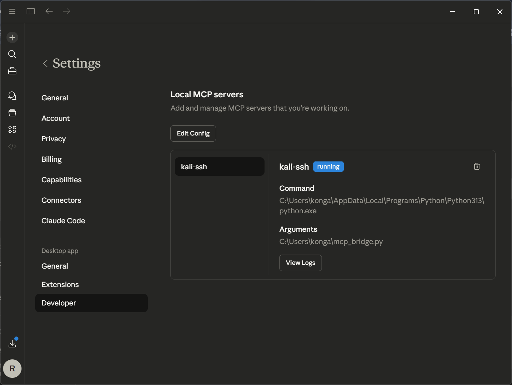
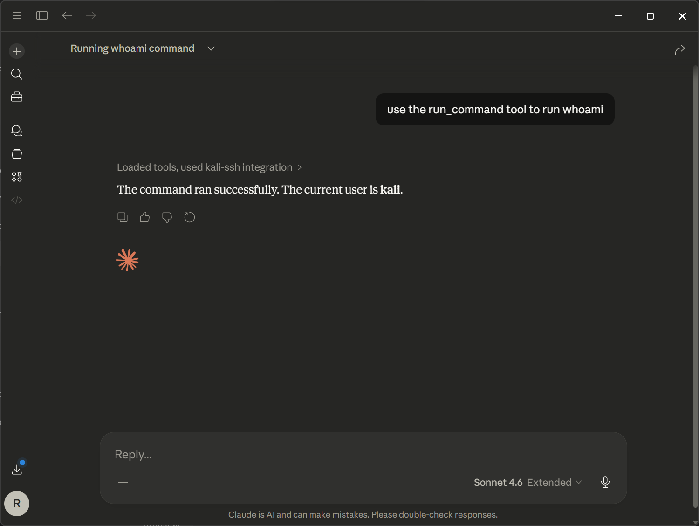
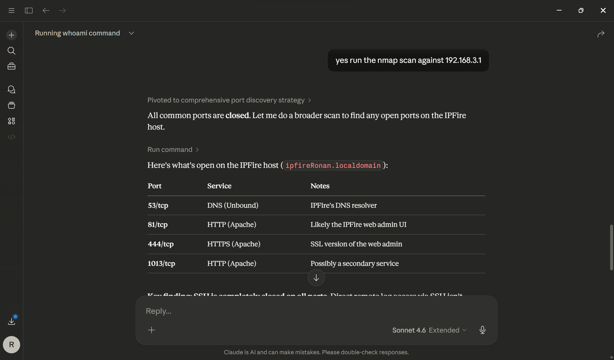
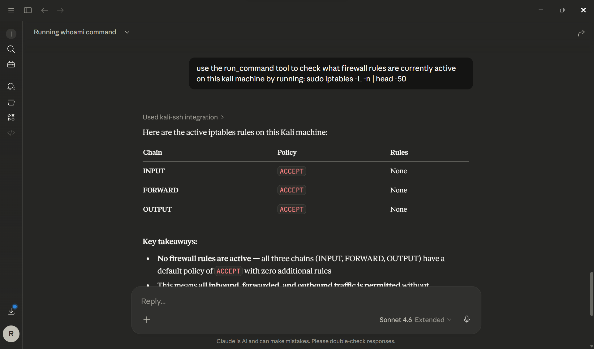

<div align="center">

```
██╗  ██╗ █████╗ ██╗     ██╗      ███████╗███████╗██╗  ██╗    ███╗   ███╗ ██████╗██████╗ 
██║ ██╔╝██╔══██╗██║     ██║      ██╔════╝██╔════╝██║  ██║    ████╗ ████║██╔════╝██╔══██╗
█████╔╝ ███████║██║     ██║█████╗███████╗███████╗███████║    ██╔████╔██║██║     ██████╔╝
██╔═██╗ ██╔══██║██║     ██║╚════╝╚════██║╚════██║██╔══██║    ██║╚██╔╝██║██║     ██╔═══╝ 
██║  ██╗██║  ██║███████╗██║      ███████║███████║██║  ██║    ██║ ╚═╝ ██║╚██████╗██║     
╚═╝  ╚═╝╚═╝  ╚═╝╚══════╝╚═╝      ╚══════╝╚══════╝╚═╝  ╚═╝    ╚═╝     ╚═╝ ╚═════╝╚═╝     
```

### Claude Desktop ↔ Kali Linux via Model Context Protocol

<br/>

[](https://python.org)
[](https://modelcontextprotocol.io)
[](https://claude.ai)
[](https://kali.org)
[](https://github.com/ronankongala/kali-ssh-mcp/actions)

<br/>

> **Give Claude a terminal.** This MCP bridge lets Claude Desktop SSH into a Kali Linux host, run commands like nmap or iptables, and read the output back in the chat.

<br/>

</div>

---

## Demo

<div align="center">

| MCP Config | Claude Connected |
|:---:|:---:|
|  |  |

| whoami via MCP | nmap via Claude |
|:---:|:---:|
|  |  |

<br/>


*Claude reviewing live iptables rules on Kali*

</div>

---

## What This Does

The bridge exposes one tool, `run_command`, which runs a shell command on the Kali host and returns stdout and stderr. Example prompts:

| Task | Example Prompt |
|---|---|
| Network recon | `"Run nmap -sV against 192.168.3.1"` |
| Firewall inspection | `"Check what iptables rules are active"` |
| Log analysis | `"Parse the last 50 lines of auth.log"` |
| Follow-up | `"Which of those open ports look unexpected?"` (Claude reads the earlier output and runs the next command itself) |

---

## Architecture

```
┌─────────────────────┐
│   Claude Desktop    │
│                     │
│  "run nmap scan..." │
└────────┬────────────┘
         │
         │  JSON-RPC over stdio
         │  (MCP Protocol 2024-11-05)
         ▼
┌─────────────────────┐
│   mcp_bridge.py     │
│                     │
│  • MCP server       │
│  • Tool handler     │
│  • SSH client       │
└────────┬────────────┘
         │
         │  SSH (paramiko)
         │  port 22
         ▼
┌─────────────────────┐
│   Kali Linux Host   │
│                     │
│  stdout / stderr    │
│  ──────────────►    │
└─────────────────────┘
```

---

## Setup

### Prerequisites

```bash
pip install paramiko
```

- Python 3.10+
- [Claude Desktop](https://claude.ai/download) with MCP support
- Kali Linux host reachable over SSH

---

### 1. Clone

```bash
git clone https://github.com/ronankongala/kali-ssh-mcp.git
cd kali-ssh-mcp
```

### 2. Configure SSH target

Edit the top of `mcp_bridge.py`:

```python
SSH_HOST = "192.168.x.x"    # Your Kali IP
SSH_PORT = 22
SSH_USER = "kali"
SSH_PASS = "kali"           # Use key-based auth outside a lab
```

### 3. Add to Claude Desktop

Open **Claude Desktop → Settings → Developer → Edit Config** and add:

```json
{
  "mcpServers": {
    "kali-ssh": {
      "command": "C:\\Path\\To\\python.exe",
      "args": ["C:\\Path\\To\\mcp_bridge.py"]
    }
  }
}
```

### 4. Restart Claude Desktop

The `kali-ssh` server should show as **running** in Developer settings.

---

## Usage

Example prompts:

```
Use the run_command tool to run: nmap -sV 192.168.3.1
```
```
Run: sudo iptables -L -n | head -50
```
```
Check who is currently logged into the system
```

Claude runs each command over SSH and works from the output in the same reply.

---

## File Structure

```
kali-ssh-mcp/
├── .github/workflows/ci.yml
├── mcp_bridge.py          # MCP server + SSH bridge
├── README.md
└── screenshots/
    ├── mcp-config.png
    ├── claude-connected-kali.png
    ├── whoami-result.png
    ├── nmap-ipfire.png
    └── iptables-review.png
```

---

## Security Notes

This is for lab and CTF environments. The sample config uses the default Kali password, so switch to key-based SSH and limit which hosts can reach port 22 before using it anywhere else. Only point it at systems you have permission to test. Every command is logged to `mcp_bridge.log`.
